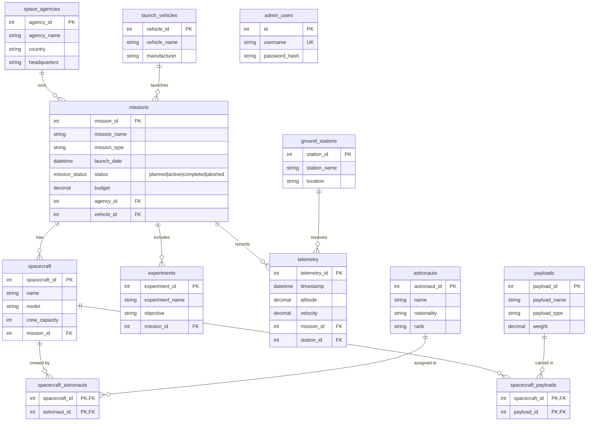

# Database Schema

```mermaid
erDiagram
    space_agencies ||--o{ missions : "runs"
    launch_vehicles ||--o{ missions : "launches"
    missions ||--o{ spacecraft : "has"
    missions ||--o{ experiments : "includes"
    missions ||--o{ telemetry : "records"
    ground_stations ||--o{ telemetry : "receives"
    spacecraft ||--o{ spacecraft_astronauts : "crewed by"
    astronauts ||--o{ spacecraft_astronauts : "assigned to"
    spacecraft ||--o{ spacecraft_payloads : "carries"
    payloads ||--o{ spacecraft_payloads : "carried in"

    space_agencies {
        int agency_id PK
        string agency_name
        string country
        string headquarters
    }
    launch_vehicles {
        int vehicle_id PK
        string vehicle_name
        string manufacturer
    }
    missions {
        int mission_id PK
        string mission_name
        string mission_type
        datetime launch_date
        mission_status status "planned|active|completed|aborted"
        decimal budget
        int agency_id FK
        int vehicle_id FK
    }
    spacecraft {
        int spacecraft_id PK
        string name
        string model
        int crew_capacity
        int mission_id FK
    }
    astronauts {
        int astronaut_id PK
        string name
        string nationality
        string rank
    }
    payloads {
        int payload_id PK
        string payload_name
        string payload_type
        decimal weight
    }
    spacecraft_astronauts {
        int spacecraft_id PK, FK
        int astronaut_id PK, FK
    }
    spacecraft_payloads {
        int spacecraft_id PK, FK
        int payload_id PK, FK
    }
    ground_stations {
        int station_id PK
        string station_name
        string location
    }
    telemetry {
        int telemetry_id PK
        datetime timestamp
        decimal altitude
        decimal velocity
        int mission_id FK
        int station_id FK
    }
    experiments {
        int experiment_id PK
        string experiment_name
        string objective
        int mission_id FK
    }
    admin_users {
        int id PK
        string username UK
        string password_hash
    }
```
